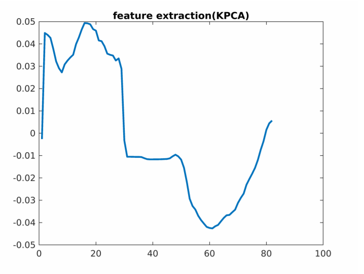
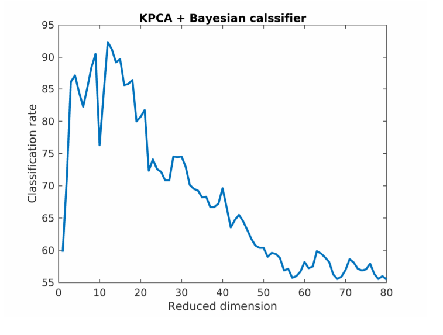
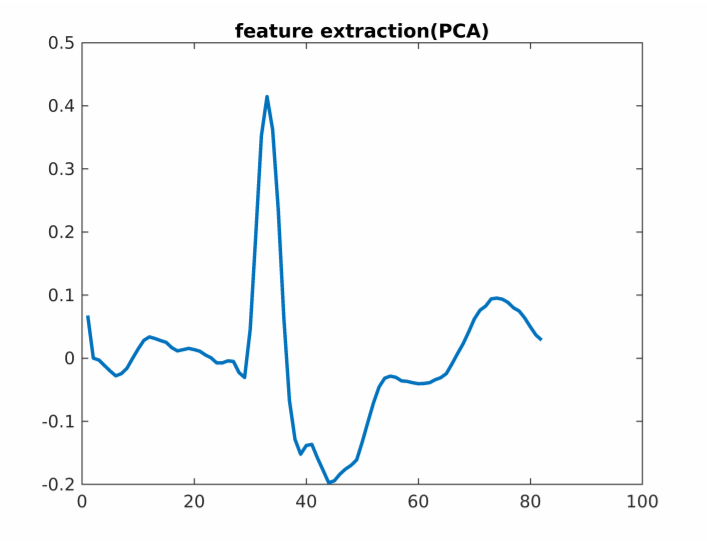
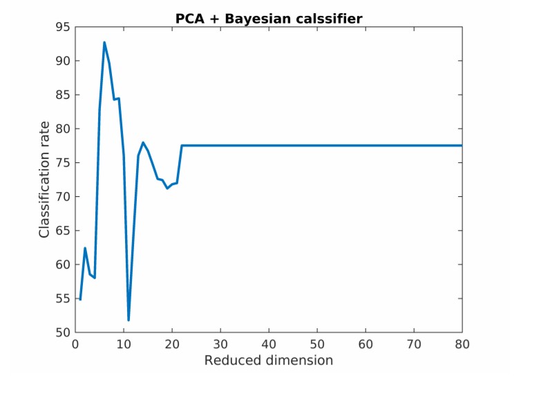

# Importing Data

```
clear;
train_data = importdata("TwoLeadECG_TRAIN.txt");
test_data = importdata("TwoLeadECG_TEST.txt");
```
# Preprocessing Data

Extracting the Labels from the Test and Training data

```
train_data(:,end+1) = train_data(:,1);
train_data(:,1) = [];
test_data(:,end+1) = test_data(:,1);
test_data(:,1) = [];
train_label=train_data(:,end);
test_label=test_data(:,end);
train_unlabeled=train_data(:,1:end-1);
test_unlabeled=test_data(:,1:end-1);
```
# Prior Calculation

We are calculating prior probability for each class.

```
no_class = max(train_label);
```
```
for j = 1:no_class
ind = find(train_label == j);
p(j) = length(ind)/length(train_label);
end
```
# Feature Extraction Using KPCA

Setting up Parameter for KPCA function and then extracting the feature matrix

and applying it to original data space

```
options = struct;
options.ReducedDim=12;
options.Kernel=0;
[V,~]=KPCA(train_unlabeled',options);
options.ReducedDim=1;
```
```
train_feature=train_unlabeled*V;
test_feature=test_unlabeled*V;
```
# Classification Using Bayes Classifier(Without feature extraction)

In this section we are applying the classifier to the original data space and calculating the

classification rate according to number of label incorrectly classified


```
Label=[];miss1=0;
t_case=size(test_unlabeled,1);
for k=1:t_case
Label(k) = Linear_classifier(train_unlabeled,train_label, ...
test_unlabeled(k,:),no_class,p);
if Label(k)~=test_label(k)
miss1=miss1+1;
end
end
```
```
Classification_rate1 = (1 - miss1/t_case)*100;
fprintf("Classification rate : %f",Classification_rate1);
```
```
Classification rate : 77.
```
# Classification Using Bayes Classifier(With feature extraction)

In this section we are applying the classifier to the feature data space that is after dimensionality

reduction and calculating the classification rate according to number of labels incorrectly classified

```
Label=[];miss=0;
t_case=size(test_feature,1);
for k=1:t_case
Label(k) = Linear_classifier(train_feature,train_label, ...
test_feature(k,:),no_class,p);
if Label(k)~=test_label(k)
miss=miss+1;
end
end
```
```
Classification_rate = (1 - miss/t_case)*100;
fprintf("Classification rate : %f",Classification_rate);
```
```
Classification rate : 92.
```
# Feature Extraction Plot

Plotting the feature extraction obtained from dimensonality reduction using KPCA

```
%feature extraction plot
plot([1:82],V(:,1),"LineWidth",2);title('feature extraction(KPCA)')
```

Here we are trying to observe relationship between number of dimension reduced

(using KPCA ) and classification rate

```
%accuracy vs reduce dimension
accuracyplot(train_unlabeled,train_label,test_unlabeled,test_label,no_class,p,'KPCA');
```

Some other methods we use includes:

1. PCA
2. LDA
3. LSDA (Locality Sensitive Discriminant Analysis) [https://www.aaai.org/Papers/IJCAI/2007/
    IJCAI07-114.pdf]

# Other Dimensionality reduction using PCA

Setting up Parameter for PCA function and then extracting the feature matrix

and applying it to original data space

```
options2 = struct;
options2.ReducedDim=6;
[V,~]=PCA(train_unlabeled,options2);
```
```
train_feature=train_unlabeled*V;
test_feature=test_unlabeled*V;
```
# Classification

In this section we are applying the classifier to the feature data space that is after dimensionality


reductionand calculating the classification rate according to number of labels incorrectly classified

```
Label=[];miss=0;
t_case=size(test_feature,1);
for k=1:t_case
Label(k) = Linear_classifier(train_feature,train_label,test_feature(k,:) ...
,no_class,p);
if Label(k)~=test_label(k)
miss=miss+1;
end
end
```
```
Classification_rate = (1 - miss/t_case)*100;
fprintf("Classification rate : %f",Classification_rate);
```
```
Classification rate : 92.
```
# Plotting

Plotting the feature extraction obtained from dimensonality reduction using PCA

```
%feature extraction plot
plot([1:82],V(:,1),"LineWidth",2);title('feature extraction(PCA)')
```

Here we are trying to observe relationship between number of dimension reduced


(using PCA ) and classification rate

```
%accuracy vs reduce dimension
accuracyplot(train_unlabeled,train_label,test_unlabeled,test_label,no_class,p,'PCA');
```

